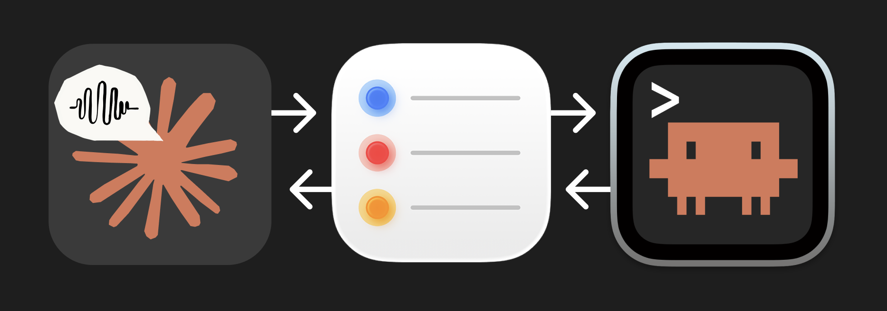
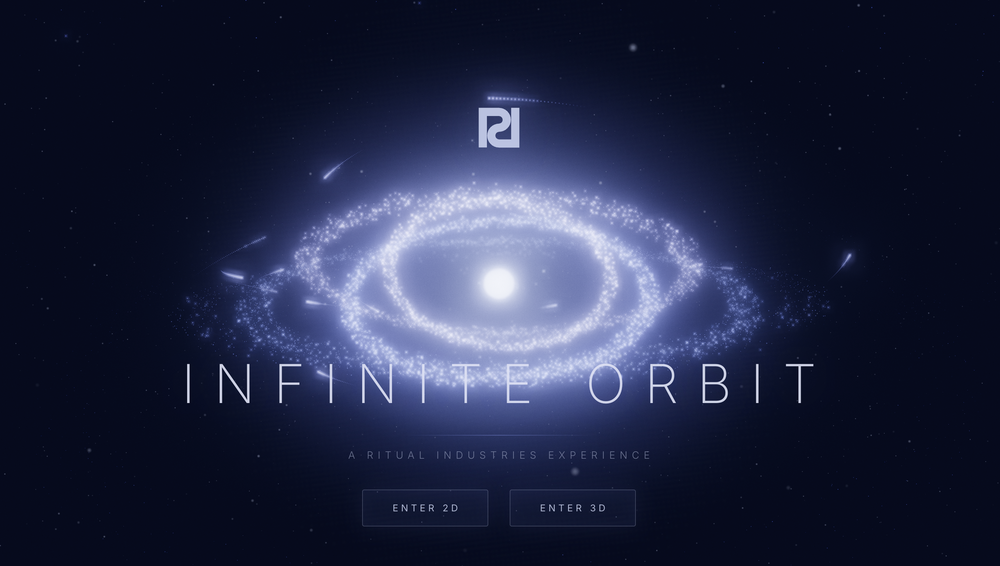

<p align="center">
  
</p>

# Reminders Bridge

> ## ⚠️ Before you start — what YOU (the human) must do
>
> An AI agent can run every command in this README, but a few things require **you**, because macOS and Apple security won't let any script do them. Read this first.
>
> **You need installed first:**
> - macOS
> - the `claude` CLI
>
> **Steps only a human can do (your AI agent will pause and ask for these):**
> - In **Apple Reminders, create two lists named exactly** `Claude Inbox` and `Claude Output`. *(The names must match exactly — this is the message bus.)*
> - Approve the **macOS Automation prompt** for Reminders the first time it runs.

**Talk to Claude on your phone. It builds on your Mac.**

Claude's voice mode is great for thinking through ideas — real-time, hands-free, back-and-forth conversation. Claude Code on your Mac is great for building things. But they don't talk to each other.

Reminders Bridge connects them using Apple Reminders as a message bus. You talk through an idea with Claude on your phone, Claude drops a prompt into your Reminders, and Claude Code on your Mac picks it up, matches it to a project, and dispatches an agent to build it. Results go back to Reminders so you can check from your phone.

I used this to build [Infinite Orbit](https://ritual.industries/orbit) — a gravity simulator game — mostly by voice while walking around outside.

<p align="center">
  <a href="https://ritual.industries/orbit">
    
  </a>
</p>

---

## How It Works

```
┌─────────────────────┐          ┌──────────────────┐          ┌─────────────────────┐
│   Claude Voice       │          │  Apple Reminders   │          │    Claude Code        │
│   (iPhone)           │          │  (iCloud sync)     │          │    (Mac)              │
│                      │          │                    │          │                       │
│  You brainstorm an   │  ──1──▶  │  "Claude Inbox"    │  ──2──▶  │  /reminders skill     │
│  idea with Claude    │          │  gets a new        │          │  detects new item     │
│  using voice mode    │          │  reminder          │          │                       │
│                      │          │                    │          │  Matches to a project │
│                      │          │                    │  ◀──3──  │  folder, dispatches   │
│  Check results on    │  ◀──4──  │  "Claude Output"   │          │  a background agent   │
│  your phone          │          │  gets the result   │          │                       │
└─────────────────────┘          └──────────────────┘          └─────────────────────┘
```

1. **You + Claude Voice** — Talk through your idea on your phone. Let Claude ask questions, suggest features, play devil's advocate.
2. **Claude writes a prompt** — When the idea is ready, Claude creates a reminder in "Claude Inbox" with the full prompt.
3. **Claude Code picks it up** — The `/reminders` skill (running on a loop) detects the new item, matches it to one of your project folders, and dispatches a background agent.
4. **The agent builds** — It reads your project context (CLAUDE.md, SESSION_LOG.md), does the work, and writes a summary back to "Claude Output."
5. **You check from your phone** — Ask voice Claude to read your Claude Output reminders, or just open the Reminders app.

---

## Requirements

- **macOS** (uses AppleScript + Apple Reminders)
- **[Claude Code CLI](https://docs.anthropic.com/en/docs/claude-code)** installed and authenticated
- **Claude Pro or Max plan** (for voice mode + CLI agents)
- **iPhone with Claude app** (for voice conversations)
- **iCloud Reminders sync** enabled on both devices

---

## Setup

### 1. Install

```bash
git clone https://github.com/brianharms/reminder-watch.git
cd reminder-watch
./install.sh
```

### 2. Create the Reminder Lists

Open Apple Reminders and create two lists (names must match exactly):

- **Claude Inbox** — where prompts from your phone land
- **Claude Output** — where results go back

### 3. Start Watching

Open Claude Code and run:

```
/loop 5m /reminders
```

> `/loop` is a **built-in Claude Code command** (no install needed) — it re-runs `/reminders` every 5 minutes. You can also just run `/reminders` once by hand to check on demand.

The first time, it'll ask where your projects folder is. Just tell it in plain English — "it's on my desktop in the projects folder" works fine. After that, it watches silently.

---

## Usage

### Sending Tasks from Your Phone

Start a voice conversation with Claude and brainstorm your idea. When it's ready:

> "Send that to Claude Code as a reminder in my Claude Inbox list. Use the title for a short description and the notes for a detailed prompt."

**Tips for good prompts:**
- **Be specific about the project name.** "Work on my gravity simulator" is better than "work on that game thing."
- **Push Claude for detail.** Voice Claude tends to summarize. Say: "Include everything we discussed — the physics, the controls, the visual style. Don't summarize."
- **One task per reminder.** Don't pack multiple unrelated tasks into one reminder.

### Checking Results

From your phone:
- Ask voice Claude: "Check my Claude Output reminders and read them to me"
- Or just open the Reminders app

From Claude Code:
- Run `/reminders` to check manually

### Voice Session Setup

Voice mode doesn't persist instructions across conversations. At the start of each voice session, say something like:

> "When I tell you to send something to Claude Code, create a reminder in my Claude Inbox list. Title should be a short description, notes should be the full detailed prompt with all context."

---

## How Project Matching Works

When a new reminder comes in, Claude Code lists your project folders and picks the best match based on the task title and notes:

- **"Work on mac caps"** → matches `mac-caps/`
- **"Let's build a new weather app"** → creates `weather-app/` (new folder)
- **"Add a feature to the portfolio site"** → matches `portfolio-site/`

**Be specific in your prompts.** The more clearly you name the project, the better the match. If your folder is called `recipe-app`, say "work on recipe-app" not "work on that cooking thing."

If no existing folder matches, Claude creates a new one with a kebab-case name in your projects directory.

---

## Configuration

After first run, your config lives at:

```
~/.claude/reminders-config.sh
```

It contains one line:

```bash
PROJECTS_DIR="/path/to/your/projects"
```

To change your projects folder, edit this file or delete it and run `/reminders` again.

---

## What's Included

| File | Purpose |
|------|---------|
| `scripts/reminder-check.sh` | Queries Claude Inbox, filters seen items, outputs new/flagged |
| `scripts/reminder-output.sh` | Writes results to Claude Output list |
| `skill/SKILL.md` | The `/reminders` Claude Code skill |
| `install.sh` | Copies scripts and skill to `~/.claude/` |

### Installed File Locations

| File | Installed To | Purpose |
|------|-------------|---------|
| Check script | `~/.claude/reminder-check.sh` | Query inbox, filter seen |
| Output script | `~/.claude/reminder-output.sh` | Write results |
| Skill | `~/.claude/skills/reminders/SKILL.md` | `/reminders` command |
| Config | `~/.claude/reminders-config.sh` | Projects directory path |
| Seen tracker | `~/.claude/reminder-seen.txt` | Processed reminder IDs |

---

## Troubleshooting

**Reminders aren't being detected:**
- Check that the list is named exactly `Claude Inbox` (capitalization matters)
- Make sure iCloud sync is working (changes on phone should appear on Mac within a few seconds)
- Try running the check script manually: `~/.claude/reminder-check.sh`

**Nothing happens when reminders come in:**
- Make sure you have `/loop` running: `/loop 5m /reminders`
- Check that Claude Code CLI is authenticated: `claude --version`
- Try `/reminders` manually to see if it picks up the item

**Wrong project matched:**
- Be more specific in your reminder title — use the exact folder name if possible
- Check what folders exist in your projects directory

**Keeping Reminders clean:**
- Tell voice Claude to mark output reminders as complete after reading them
- Apple Reminders slows down with many incomplete items that have long notes

---

## Uninstall

Delete these files:

```bash
rm ~/.claude/reminder-check.sh
rm ~/.claude/reminder-output.sh
rm -rf ~/.claude/skills/reminders/
rm ~/.claude/reminders-config.sh    # your config
rm ~/.claude/reminder-seen.txt      # tracking file
```

---

## Background

I built this because I think best when I'm moving — walking, not sitting at a desk. The technology exists to have a voice conversation that develops an idea and hands it off to a coding agent. Nobody's shipped that as a native experience yet, so I hacked it together with Apple Reminders and a few shell scripts.

It's not elegant, but it works. I hope it inspires the right people to build this properly.

— [Brian Harms](https://ritual.industries)

## For AI coding agents

This is a small, dependency-free Bash + AppleScript project. macOS-only (it talks to Apple Reminders via `osascript`). The folder is named `reminder-watch`; the user-facing product name is **Reminders Bridge**.

### Repo layout
- `scripts/reminder-check.sh` — Reads the **Claude Inbox** list for incomplete reminders, filters out IDs already recorded in `~/.claude/reminder-seen.txt`, marks each new one complete (so it isn't reprocessed), and also reads the **Claude Output** list for flagged items. Emits pipe-delimited lines (`NEW|title|notes`, `FLAGGED|title|notes`); exits `1` when nothing is new.
- `scripts/reminder-output.sh` — Writes a reminder into the **Claude Output** list. Usage: `reminder-output.sh "Title" "Body" [true|false]` (third arg `true` sets priority to 1 / urgent). Called by dispatched agents to report results back to the phone.
- `skill/SKILL.md` — The `/reminders` Claude Code skill (frontmatter `name: reminders`). Orchestrates the whole loop: config check → run check script → match each new task to a project folder → dispatch a background agent → report. **Read this first** to understand the end-to-end flow.
- `install.sh` — Copies the two scripts to `~/.claude/` and the skill to `~/.claude/skills/reminders/`, touches the seen file, and prints next steps. No daemon, no build step.
- `README.md` — User-facing docs (setup, usage, project-matching, troubleshooting).
- `banner.png`, `infinite-orbit-screenshot.png` — README images.
- (No `docs/` directory ships — git doesn't track empty folders. Add one if you write docs.)
- `.gitignore`, `LICENSE` (MIT), `.gitignore`.

### Entry points
Start with `skill/SKILL.md` (the control flow), then `scripts/reminder-check.sh` (the read side) and `scripts/reminder-output.sh` (the write side). There is no application binary — the "runtime" is Claude Code executing the skill on a loop.

### Build / run / test locally
There is nothing to compile. To exercise it:
1. In Apple Reminders, create two lists named exactly `Claude Inbox` and `Claude Output`.
2. `./install.sh` (copies into `~/.claude/`), or run the scripts straight from `scripts/` for testing.
3. Add a reminder to `Claude Inbox`, then run `bash scripts/reminder-check.sh` — expect a `NEW|...` line and exit `0`; run it again and expect exit `1` (already seen / marked complete).
4. Test the write side: `bash scripts/reminder-output.sh "Test" "Hello" true` — a flagged reminder should appear in `Claude Output`.
5. End-to-end inside Claude Code: `/reminders` once (configures the projects folder), then `/loop 5m /reminders`.
First run with a fresh seen file will mark existing inbox reminders complete — test with disposable reminders.

### Invariants — do not break
- **macOS-only.** All inbox/output access goes through `osascript`. Don't replace AppleScript with anything that isn't present by default on macOS, and keep the `uname == Darwin` preflight in `install.sh`.
- **Exact list names.** The literal strings `"Claude Inbox"` and `"Claude Output"` are the protocol contract between phone-Claude and desktop-Claude. Don't rename them or make them configurable without updating the README, skill, and both scripts together.
- **Pipe-delimited protocol tokens.** `reminder-check.sh` emits `NEW|...` and `FLAGGED|...`, and `SKILL.md` parses exactly those prefixes. Keep the `|` field delimiter and `\t`-delimited AppleScript output (`reminder id \t name \t body`) in sync between the script and any consumer.
- **Idempotency / seen-tracking.** New reminders are recorded in `~/.claude/reminder-seen.txt` and marked `completed` to prevent reprocessing. Preserve this dedupe behavior; reminder **id** (not name) is the identity key.
- **Exit-code contract.** `reminder-check.sh` returns `1` for "nothing new" and `0` when items exist; the skill relies on `1` to return silently. Don't change these semantics.
- **AppleScript string escaping.** `reminder-output.sh` escapes backslashes and double-quotes via `escape_as()` before interpolating into the AppleScript literal. Any new user-supplied string injected into an `osascript` heredoc must be escaped the same way.
- **Agent guardrails in the dispatch prompt.** The `SKILL.md` agent prompt forbids deleting files, `git push`/deploy, posting to external APIs, and touching projects outside the resolved `PROJECT DIR`. Keep these guardrails when editing the dispatch template.
- **Secrets stay out of git.** `.gitignore` excludes `.env*`, `certs/`, `*.pem/*.key/*.p12`, `credentials.json`, `*-seen.txt`, `*.log`, plus internal dev notes (`CLAUDE.md`, `SESSION_LOG.md`, `.claude/`). Never commit these or the user's seen-tracker.

### Placeholdered / personal config — keep generic
- **No hardcoded projects path.** The projects directory is never baked in. It is resolved at first run and written to `~/.claude/reminders-config.sh` as a single line `PROJECTS_DIR="..."`. Keep this parameterized — don't reintroduce a personal absolute path (e.g. anyone's `~/Desktop/...`) into the scripts or skill.
- **All state lives under `~/.claude/`** via `${HOME}` (`reminder-seen.txt`, `reminders-config.sh`, installed scripts/skill). Keep paths `$HOME`-relative, not user-specific.
- The only personal references that should remain are the author attribution and example URLs in `README.md`/script header comments (`github.com/brianharms/reminder-watch`, the Infinite Orbit links, MIT copyright). Example project names in the README (`mac-caps`, `weather-app`, `portfolio-site`) are illustrative only — don't treat them as real paths.
